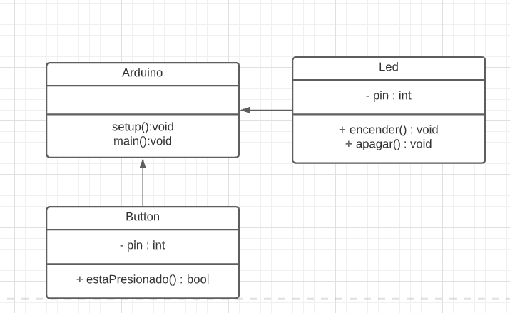

# Ejercicio 5
 Realizar un programa que me permita controlar el estado de un led utilizando un pulsador externo.
  El led debe estar encendido cuando el pulsador esté presionado y apagado cuando no lo esté.

## Diagrama de clase
Se debe construir un diagrama de clases, para ellos vamos a realizar 3 pasos para poder construir nuestro diagrama.

### Paso 1 - Entidades.
Para poder realizar este programa se debe detectar las entidades/objectos que interactua en nuestro sistema.
De forma rapida podemos detectar que tenemos 2 entitdades.
- Led
- Button

### Paso 2 - Modelar.
En este paso, vamos a tomar cada una de las entidades y vamos a razonar de forma logica los atributos y acciones/comportamiento que puede tomar nuestras entidades.

Primero vamos a arrancar por el led.
##### LED
Vamos a razonar los comportamientos de un led:
Un led se puede encender o apagar y para controlar este estado, se debe manejar la salida digital de un pin.

De esta forma podemos detectar que vamos a tener un atributo llamado pin, el cual va ser un entero, ya que el led se puede conectar un pin del microcontrolador el cual va estar identificado por un numero entero.

Tambien podemos ver que va a tener 2 comportamiento (funciones o methodos):
 encender y apagar.
 El cual no nos intereza que retorne nada, por lo tanto ambos van a ser del tipo VOID.

en resumen:
###### Atributos:
|  nombre de variable |  tipo de dato |
| ------------ | ------------ |
|   pin |  int |


###### Acciones:
|  metodos |  tipo de dato |
| ------------ | ------------ |
|   encender() |  void |
|   apagar() |  void |

##### Button
Vamos a razonar los comportamientos de un pulsador:
Un pulsador se puede presionar o no. Para poder detectar este estado, debemos leer una entrada digital de un pin del microcontrolador.

De esta forma podemos detectar que vamos a tener un atributo llamado pin, el cual va ser un entero, ya que el pulsador se puede conectar a cualquier pin del microcontrolador el cual va estar identificado por un numero entero.

Tambien podemos ver que va a tener 1 comportamiento (funciones o methodos), el cual va ser saber si el pulsador se encuentra presionado.
Como el pulsador solo tiene 2 estados (esta presionado - no esta presionado ), vamos a utilizar un tipo de dato booleano para retonar el estado del pulsador.

en resumen:
###### Atributos:
|  nombre de variable |  tipo de dato |
| ------------ | ------------ |
|   pin |  int |


###### Acciones:
|  metodos |  tipo de dato |
| ------------ | ------------ |
|  estaPresionado() |  bool |

#### Pase 3 - Diagrama de clase
Tenga en cuenta que un diagrama de clase esta conformado por 3 partes.
- Nombre de la clase
- Atributos
- Metodos o acciones.

Para los atributos vamos a utilizar el encapsulamiento privado (-)
Para los metodos vamos a utilizar el encapsulamiento publico. (+)




## Codigo

*NOTA: no pose logica Arduino*

```cpp
//Genero las clases.
class Led{
	//declaro los atributos:
	private:
	int pin;
	
	//Creo el  metodo contructor.
	public:
	Led(int p){}
	
	//metodos de acciones/comportamiento
	void encender(){}
	void apagar(){}
	
};
class Button{
	//declaro los atributos:
	private:
	int pin;
	
	//Creo el  metodo contructor.
	public:
	Button(int p){}
	
	//metodos de acciones/comportamiento
	bool estaPresionado(){}	
	
};

/* PROGRAMA PRINCIPAL*/
//Declaro e instancio los objetos, siempre arriba void setup
Led led_1 = Led(PIN_LED);
Button button_1 = Butotn(PIN_BUTTON);
void setup(){}

void loop(){
	if(button_1.esPresionado/()){
		led_1.encender();
	}else{
		led_1.apagar();
	}
}

```
