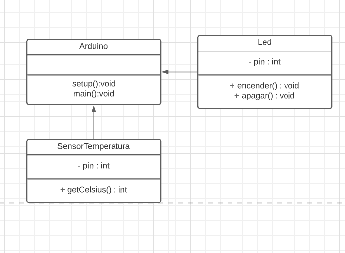

# Ejercicio 6
/
Realizar un programa el cual me permita ver en un LED RGB el estado de la temperatura hambiente.

Si la temperatura es menor a 15º C, el LED azul se encenderá.
Si la temperatura se encutra entre 15º y 25º C, el LED verde se encenderá.
Si la temperatura es mayor a 25º C, el LED rojo se encenderá. 

## Diagrama de clase
Se debe construir un diagrama de clases, para ellos vamos a realizar 3 pasos para poder construir nuestro diagrama.

### Paso 1 - Entidades.
Para poder realizar este programa se debe detectar las entidades/objectos que interactua en nuestro sistema.
De forma rapida podemos detectar que tenemos 2 entitdades.
- Led
- SensorTemperatura

### Paso 2 - Modelar.
En este paso, vamos a tomar cada una de las entidades y vamos a razonar de forma logica los atributos y acciones/comportamiento que puede tomar nuestras entidades.

Primero vamos a arrancar por el led.
##### LED
Vamos a razonar los comportamientos de un led:
Un led se puede encender o apagar y para controlar este estado, se debe manejar la salida digital de un pin.

De esta forma podemos detectar que vamos a tener un atributo llamado pin, el cual va ser un entero, ya que el led se puede conectar un pin del microcontrolador el cual va estar identificado por un numero entero.

Tambien podemos ver que va a tener 2 comportamiento (funciones o methodos):
 encender y apagar.
 El cual no nos intereza que retorne nada, por lo tanto ambos van a ser del tipo VOID.

en resumen:
###### Atributos:
|  nombre de variable |  tipo de dato |
| ------------ | ------------ |
|   pin |  int |


###### Acciones:
|  metodos |  tipo de dato |
| ------------ | ------------ |
|   encender() |  void |
|   apagar() |  void |

##### SensorTemperatura

Vamos a razonar los comportamientos de un sensor de temperatura analogico:
Un sensor de temperatura analogico, va a variar su valor con respecto a la temperatura, para poder medir estos cambios es necesario utilizar un pin analogico del microcontrolador.

De esta forma podemos detectar que vamos a tener un atributo llamado pin, el cual va ser un entero, ya que el sensor se puede conectar a cualquier pin analogico del microcontrolador el cual va estar identificado por un numero entero.

Tambien podemos ver que va a tener 1 comportamiento (funciones o methodos), el cual va ser saber leer la temperatura actual en grados celsius.
Como la temperatura puede ir variar su valores de forma positiva y negativa, vamos a utilziar un tipo de dato entero, ya que no nos interesa sus decimales.


en resumen:
###### Atributos:
|  nombre de variable |  tipo de dato |
| ------------ | ------------ |
|   pin |  int |


###### Acciones:
|  metodos |  tipo de dato |
| ------------ | ------------ |
|  getCelsius() |  int |

#### Pase 3 - Diagrama de clase
Tenga en cuenta que un diagrama de clase esta conformado por 3 partes.
- Nombre de la clase
- Atributos
- Metodos o acciones.

Para los atributos vamos a utilizar el encapsulamiento privado (-)
Para los metodos vamos a utilizar el encapsulamiento publico. (+)




## Codigo

*NOTA: no pose logica Arduino*

```cpp
//Genero las clases.
class Led{
	//declaro los atributos:
	private:
	int pin;
	
	//Creo el  metodo contructor.
	public:
	Led(int p){}
	
	//metodos de acciones/comportamiento
	void encender(){}
	void apagar(){}
	
};
class Button{
	//declaro los atributos:
	private:
	int pin;
	
	//Creo el  metodo contructor.
	public:
	Button(int p){}
	
	//metodos de acciones/comportamiento
	bool estaPresionado(){}	
	
};

/* PROGRAMA PRINCIPAL*/

//Declaro e instancio los objetos, siempre arriba void setup
Led led_rojo=Led(PIN_LED_ROJO);
Led led_verde=Led(PIN_LED_VERDE);
Led led_azul=Led(PIN_LED_AZUL);
SensorTemperatura sensor_temp=SensorTemperatura(PIN_SENSOR_TEMP);


void setup()
{}

void loop()
{
    if(sensor_temp.getCelsius()<15)
    {
        //enciendo el led azul y apago el resto
        led_azul.encender();
        led_verde.apagar();
        led_rojo.apagar();
    }
    else if(sensor_temp.getCelsius()>=15 && sensor_temp.getCelsius()<=25)
    {
        //enciendo el led verde y apago el resto
        led_azul.apagar();
        led_verde.encender();
        led_rojo.apagar();
    }
    else if(sensor_temp.getCelsius()>25)
    {
        //enciendo el led rojo y apago el resto
        led_azul.apagar();
        led_verde.apagar();
        led_rojo.encender();
    }    
}

```
